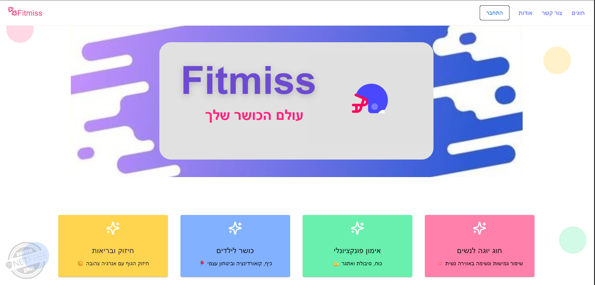

# Fitmiss – Personal Fitness Tracker 🏃‍♀️

A colorful, kid-friendly web application that allows users to create and follow personalized workout tracks. Developed with a playful, gamified interface using React and ASP.NET Core.

## 🎯 Key Features

- Homepage with fitness classes for different target audiences  
- Secure login & signup form  
- Smart track generation based on category & time selection  
- Clear exercise instructions with grading and score calculation  
- Track result summary page  
- Track history with exercise breakdown & scores  
- Contact form with email integration  

## 💻 Technologies

- **Frontend**: React  
- **State Management**: Redux Toolkit  
- **Backend**: ASP.NET Core (C#)  
- **Database**: SQL Server  

## 📁 Project Structure

fitness-track-app/
├── client/
│ ├── public/
│ │ └── screenshots/ # Screenshots for README
│ │ ├── screenshot1.png
│ │ ├── screenshot2.png
│ ├── components/
│ ├── pages/
│ └── ...
├── server/
│ ├── Controllers/
│ ├── Models/
│ ├── Data/
│ └── ...
└── Insert_FitnessTracks_Data.sql

markdown
Copy
Edit

## ▶️ How to Run

### 🖥 Backend
1. Open the `server` folder in Visual Studio  
2. Run the project  

### 🌐 Frontend
```bash
cd client
npm install
npm run dev
🖼 Screenshots
## 🖼 Screenshots

### Home Page


### Track History


### Exercise Page


### Summary Page


### Login Page


📧 yaelaxelrad515@gmail.com
